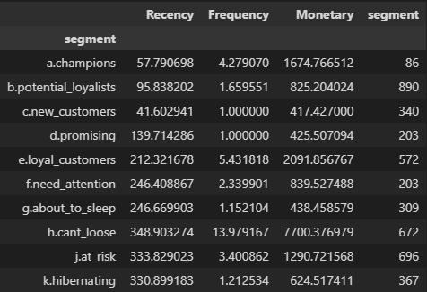

# Data Analysis

## TR
Veri analizi alanında yaptığım çalışmaları buradan inceleyebilirsiniz. Aynı zamanda veri mühendisi adayıyım. Veri mühendisliğine dair yaptığım; ETL-ELT ve veri modellemesi uygulamalarımı da inceleyebilirsiniz.

## ENG
You can review my work in the field of data analysis here. I am also a data engineer candidate. You can also review my ETL-ELT and data modeling applications related to data engineering.

### Churn Model Performance:

- Accuracy: 0.9595
- Precision: 0.9272
- Recall: 0.9198
- F1 Score: 0.9235
- ROC AUC: 0.9909

### RFM Model Comments:

+ Can't loose customers has high recency value. We can start a new CRM campaign for them. For example, we send them an email about their most purchased products to attract them.

+ For customers in the at risk and hibernating segments, it may be useful to find out why they have not shopped for so long. Because we have about 1500 clients and they have a high monetary value. If necessary, we can collect information from them via email or sms and remind ourselves.

+ It's been over a month without shopping since new customers. These customers can be reminded of their most recent purchases and offered relevant products or we can send an email for thanks to their purchases.

+ Loyal customers can be emailed about the products they buy the most.

+ Instead of investing in about to sleep customers, it makes more sense to invest in existing customers (e.g. champions, potential loyalists).

+ Return campaigns can be offered for customers who have not been with us for a long time. (e.g hibernating, at risk, need attention)