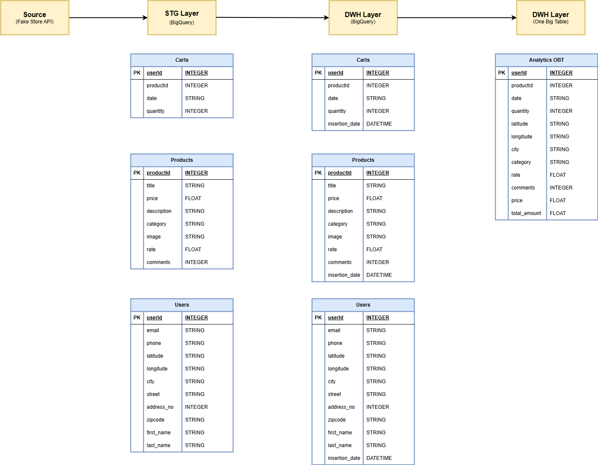

# **About Project**

Receiving data via Fake Store API, storing it on staging, performing the necessary transformations (data profiling, data cleansing, data transformation) and finally collecting all data on obt (one big table).

Here we see how obt can be used for small volumes of data. We can access the reports we want through Power BI without setting up any join, relation or modeling.

A low-budget and fast analytical solution that we can use when working with small volumes of data.

Translated with DeepL.com (free version)

## Note

- I've used, Airflow 3. So there might be few differences from previous versions.

### ETL Process

- Source([Fake Store API](https://fakestoreapi.com/)) → Staging(BigQuery) → DWH Analytics OBT (BigQuery)

**How It Works?**

- Gathering data from source than sending it to staging (stg) layer to make data transformation, data profiling and understanding the data.
- After this, sending data to DWH layer. Cleansed, transformed, profiled.
- At the end of all, we're ready to build OBT. It means, gather all that information in one big table (thats where OBT comes from).

### Technologies Used

- Python (3.12.0), Airflow (3.0.0), BigQuery