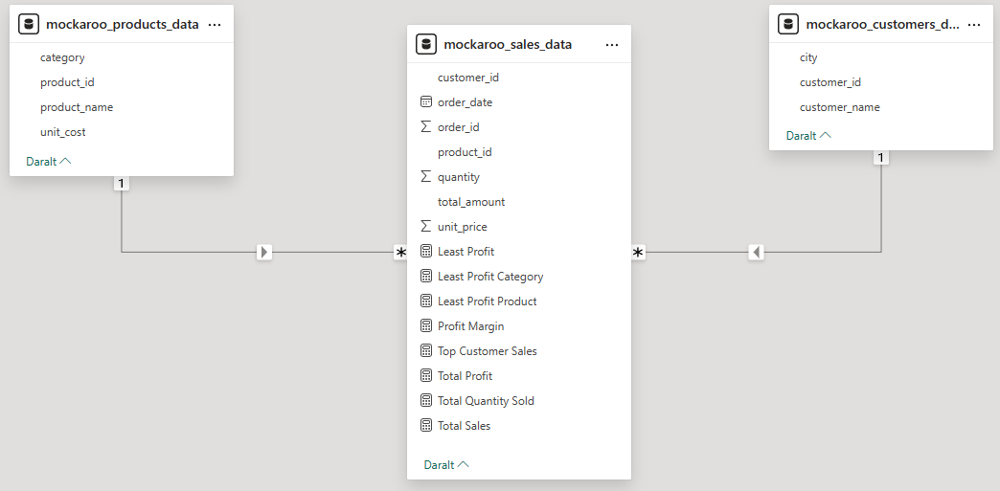
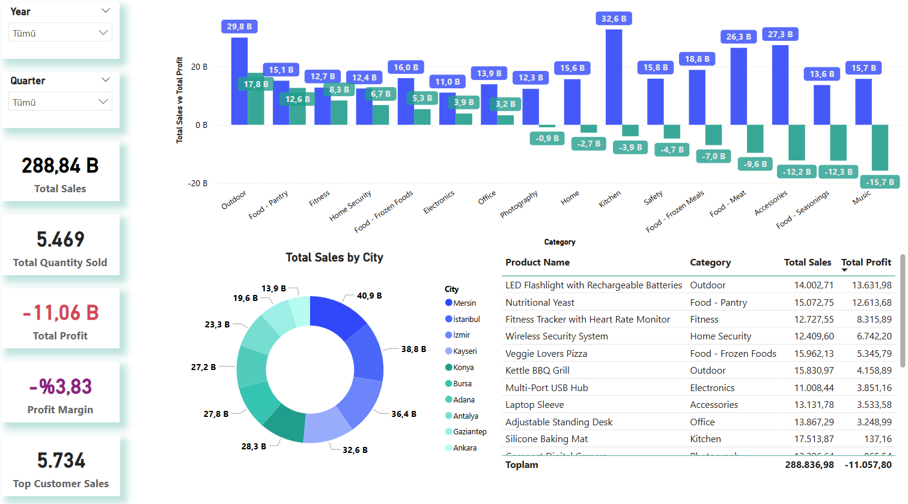
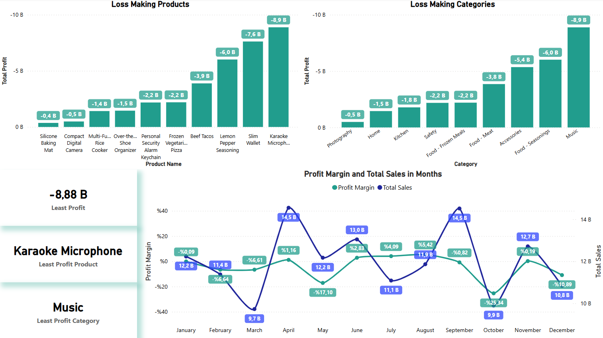

### Information

Here I'm demonstrating a Power BI model for current data warehouse model. I've created 3 datasets from Mockaroo's API;

- mockaroo_sales_data: Fact table that includes all orders by customer and product.

- mockaroo_products_data: Dimension table containing product information.

- mockaroo_customers_data: Dimension table containing customer information.

Those 3 tables, shows how modern data warehouse models work and how they relate to each other. While building a Power BI dashboard you can use those datasets as reference.

Note: With *generating_random_data_for_pbi.py* you can create your own dataset and start building modern Power BI dashboards. Hope it's helpfull.

### From Dashboard

- **Relationships**

This visual demonstrates how the tables are **related** to one another. You can also see calculated fields built using **DAX** formulas.

- **First Look**

This page highlights the most important **KPIs** and shows trends across categories, products, and cities based on those **KPIs**.

- **Caution**

This section focuses on insights that require attention such as the **least profitable products** or **categories**. It also shows **profitability trends over time**.

### DAX Formulas for Calculated Fields

**Least Profit** = 
MINX (
    SUMMARIZE (
        mockaroo_sales_data,
        mockaroo_sales_data[product_id],
        "TotalProfit", [Total Profit]
    ),
    [TotalProfit]
)

**Least Profit Category** = 
VAR MinCategory =
    CALCULATE (
        TOPN (
            1,
            VALUES(mockaroo_products_data[category]),
            [Total Profit],
            ASC
        )
    )
RETURN
CALCULATE (
    SELECTEDVALUE(mockaroo_products_data[category]),
    mockaroo_products_data[category] = MinCategory
)

**Least Profit Product** = 
VAR MinProductID =
    CALCULATE (
        TOPN (
            1,
            VALUES(mockaroo_sales_data[product_id]),
            [Total Profit],
            ASC
        )
    )
RETURN
CALCULATE (
    SELECTEDVALUE(mockaroo_products_data[product_name]),
    mockaroo_products_data[product_id] = MinProductID
)

**Profit Margin** = 
DIVIDE(
[Total Profit],
[Total Sales],
0)

**Top Customer Sales** = MAXX(mockaroo_customers_data, CALCULATE([Total Sales]))

**Total Profit** = SUMX(mockaroo_sales_data,mockaroo_sales_data[quantity] * (mockaroo_sales_data[unit_price] - RELATED(mockaroo_products_data[unit_cost])))

**Total Quantity Sold** = CALCULATE(SUM(mockaroo_sales_data[quantity]))

**Total Sales** = SUMX(mockaroo_sales_data, mockaroo_sales_data[quantity] * mockaroo_sales_data[unit_price])